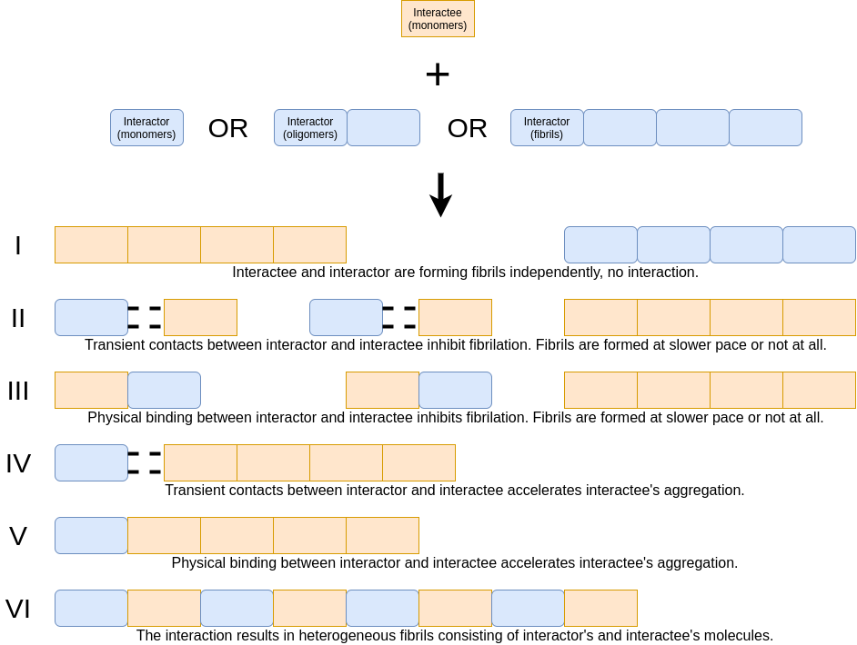

```{r, include = FALSE}
knitr::opts_chunk$set(
  collapse = TRUE,
  comment = "#>"
)

library(chipPCR)
library(dplyr)
library(ggplot2)
library(patchwork)
```

# General assumptions

## Main definitions

1. An **interactee** is always acted upon by an **interactor**. Suppose the publication uses words like 'co-incubation' and from the text itself it is not clear how to distinguish between interactor and interactor. Additionally, the authors study the effect of Protein A on Protein B and vice versa. In this case, we annotate it as two separate interactions: A is an interactor over B and B, where B is an interactor over A.
2. General logic:
    1. Operator OR is valid for a and b means: I) a, II) b, III) a and b
    1. Operator AND is valid for a and b only when we have a and b simultaneously.
3. Authors’ interpretation always supersedes ours.
4. We refrain from using vague terms as seeding or cross-seeding. Instead, we describe the interaction using three descriptors (described in the section XYZ).
5. We refer to glossary provided by [MIRRAGGE – Minimum Information Required for Reproducible AGGregation Experiments (doi: 10.3389/fnmol.2020.582488)](https://doi.org/10.3389/fnmol.2020.582488).
    1. Additional terms: 
        * **T50**: the time required for the amyloid reaction to reach 50% of the final fluorescence intensity.

## General interaction scenarios 
 


We assume that six main scenarios can occur during the interaction of two amyloid proteins (see the figure above). Scenarios depend on the binding type between interactor and interactee and the impact on the interactee's fibrillization speed. If there is no interaction between interactor and interactee, amyloid proteins are forming fibrils independently - scenario I occurs. If there is transient contact between interactor and interactee along with fibrillation inhibition - scenario II takes place, but if interactee's fibrillation is accelerated - scenario IV. If the physical binding between interactor and interactee occurs together with fibrillation inhibition - scenario III happens, but if interactee's fibrillation is accelerated - scenario V or VI takes place.

scenario I:  no interaction between interactor and interactee & amyloid proteins are forming fibrils independently
scenario II:  transient contact between interactor and interactee & fibrillation inhibition
scenario III:  physical binding between interactor and interactee & fibrillation inhibition
scenario IV: transient contact between interactor and interactee & fibrillation acceleration
scenario V or VI: physical binding between interactor and interactee & fibrillation acceleration

The scenarios are discrete but rather points of the continuum (e.g., depending on the concentration of the interactor we can have no effect or acceleration of the fibrillization). Therefore, we do not imply that each interaction follows strictly one of these scenarios, but rather presents most dominantly one of them. To distinguish between these interaction scenarios we design three descriptors (described below). Descriptor 1. differentiates between scenarios I (no effect on kinetics) II and III (inhibited aggregation) as well as IV, V and VI (acceleration). Descriptor 2. discriminates between scenarios IV and V/VI. Descriptor 3. differentiates between scenarios V and VI.

For example, if descriptor 1 is **faster aggregation**, descriptor 2 - **yes, direct evidence** and descriptor 3 - **yes**, they describe cross-seeding.


### Descriptors:

### Descriptor 1. The impact on the speed of the interactee' fibrillization.

**_General remarks:_** this descriptor is fully based on the kinetics or any kinetic data. Here, we mean aggregation to the level of mature fibril (fibrillization) confirmed by e.g., microscopy images. If the interactor accelerates the speed of the oligomer formation, but they never aggregate into the level of mature fibrils (fibrillization does not occur), it is not an acceleration as we understand it. The commonly used technique here is Thioflavin T (ThT) assay [CITATION NEEDED]. We are aware of the fact ThT is not always quantitative, i.e. a higher (or lower) ThT level - under different conditions (e.g. the presence of the interactor) - can be caused by changes to the fibril structure rather than the amount of fibrils, but for the purpose of simplification, we are ignoring it and always follow the interpretation of authors.

1. **Faster aggregation**: a) the maximum ThT emission observed at the end of the reaction of the interactee and interactor is higher than maximum ThT emission for interactee alone OR b) if the slope of the kinetic curve is steeper OR c) the lag phase is shorter OR d) T50 is lower. The fibrillization still occurred. 
2. **Slower aggregation**: a) the maximum ThT emission observed at the end of the reaction of the interactee and interactor is lower than maximum ThT emission for interactee alone AND b) the slope of the kinetic curve is less steep) OR c) the lag phase is longer. So we need (a AND b) OR c. The fibrillization still occurred. 
3. **No aggregation**: there is no confirmed fibrilization after the interaction.
4. **No effect**: a) The slopes of kinetic curves are visibly similar AND b) the maximum ThT emission is similar AND c) the lag phase is similar.
5. **No information**: there were no kinetic assays.

 
```{r,echo=FALSE,message=FALSE,warning=FALSE,fig.width=8,fig.cap="Comparison of ThT curves."}
set.seed(1)

p1 <- rbind(mutate(AmpSim(cyc = 1:40), curve_type = "faster fibrillization (steeper slope)"),
      mutate(AmpSim(cyc = 1:40, b.eff = -8), curve_type = "slower fibrillization")) %>% 
  ggplot(aes(x = cyc, y = fluo, color = curve_type)) + 
  geom_line() +
  scale_x_continuous("Time") +
  scale_y_continuous("ThT fluorescence") +
  scale_color_manual("", values = c("#D79B00", "#6C8EBF")) +
  ggtitle("Slope")


p2 <- rbind(mutate(AmpSim(cyc = 1:40), curve_type = "faster fibrillization (shorter lag phase)"),
      mutate(AmpSim(cyc = 1:40, Cq = 30), curve_type = "slower fibrillization")) %>% 
  ggplot(aes(x = cyc, y = fluo, color = curve_type)) + 
  geom_line() +
  scale_x_continuous("Time") +
  scale_y_continuous("ThT fluorescence") +
  scale_color_manual("", values = c("#D79B00", "#6C8EBF")) +
  ggtitle("Lag phase")

p3 <- rbind(mutate(AmpSim(cyc = 1:40, ampl = 1.5), curve_type = "faster fibrillization (higher maximum ThT emission)"),
            mutate(AmpSim(cyc = 1:40), curve_type = "slower fibrillization")) %>% 
  ggplot(aes(x = cyc, y = fluo, color = curve_type)) + 
  geom_line() +
  scale_x_continuous("Time") +
  scale_y_continuous("ThT fluorescence") +
  scale_color_manual("", values = c("#D79B00", "#6C8EBF")) +
  ggtitle("Maximum ThT emission")


(p1 + p2 + p3)*(theme_bw(base_size = 9) +
  theme(legend.position = "bottom",
        legend.direction = "vertical",
        plot.background = element_rect(fill = NA),
        axis.text = element_blank()))
```
 
### Descriptor 2. Physical binding between interactee and interactor.

1. **Yes, direct evidence**: there is an experimental evidence that fibrils consist of two different amyloids (labeling; immunolabeling). It also applies if we have a visible colocalization of an interactee and an interactor visible in the microscopic images.
2. **Yes, implied by kinetics**: if seeding is implied by kinetic experiments results and as such it is interpreted by authors of the publication. In principle, this answer covers every acceleration of the fibrillization confirmed by kinetic experiments.
3. **No**: no effect on the elongation of interactee’s fibrils.
4. **Formation of fibrils by the interactee is inhibited**: the formation of interactee’s aggregates was slowed or completely halted by the interactor.
5. **No information**: there is no experimental evidence and seeding is not implied by kinetics experiments results.


### Descriptor 3. Presence of the heterogenous fibrils consisting of interactor and interactee molecules.

1. **Yes:** applies when a) there is experimental evidence that fibrils consist of two different amyloids (labeling; immunolabeling) AND b) the mature fibrils are structurally different than fibrils formed in the presence of interactor c) the term co-aggregation/ heterogeneous fibrils/ hybrid fibrils is used to describe the aggregation process. 
2. **No:** if the resulting amyloid fibrils have the dimension matching that of the aggregating interactee alone. a) the mature fibrils are confirmed by a microscopy technique to have the same structure as fibrils formed by the interactee without the presence of the interactor  OR b) there is no fibrillar product at all OR c) an interactee and an interactor are the same protein.
3. **No information**: there is no experimental evidence and seeding is not implied by kinetics experiments results.


## Information on the sequence of interactor and interactee

**Name of the amyloid protein**: was chosen from a [list of amyloid proteins] (https://github.com/KotulskaLab/AmyloGraph/blob/main/inst/AmyloGraph/protein_data.csv) considered by us. Every protein on the list has confirmed amyloid-like properties.
 
**Sequence:** The sequence is a vector of amino acids. 

1. In the case when the exact sequence is not known, we provide the largest possible precursor.
3. If interactee or interactor are mutants/fragments of an amyloid protein, we provide only the sequence of the mutant/fragment and not the wild type protein.
4. We consider sequences that have modified amino acids (e.g., methylated), but we do not include this information in the sequence.
5. We do NOT consider mutants that have instead of standard amino acids a) non-biogenic amino acids (e.g., tyramine) b) non-amino acid linkers. 

**Source sequence:** here we provide the sequence of an original protein by its UniProt ID:
The AmyloGraph database treats as a single protein a protein that can occur in many taxonomic variants or after modifications (e.g., we have human and bovine precursor albumins, [P02768](https://www.uniprot.org/uniprot/P02768) and [P02769](https://www.uniprot.org/uniprot/P02769) as well as the products of the post-translational modifications, [Q56G89](https://www.uniprot.org/uniprot/Q56G89)). 

The source sequence may be not identical to the interactor’s or interactee’s sequence. However, interactor or interactee might be a part of the source sequence (as human Amyloid beta 1-40 is a part of the [P05067](https://www.uniprot.org/uniprot/P05067)) or a mutated variant of a source sequence (when some amino acids are altered compared to the original sequence).

If the sequence of the interactor or the interactee contains modified amino acid residues (e.g., phosporylated), we do not supply this information in the sequential data.

# Data acquisition

## Manuscript collection 

AmyloGraph requirements for manuscripts reporting interactions between amyloid proteins

We started our manuscript collection on amyloid-amyloid interactions by defining the eligibility criteria. We have focused on original experimental results of amyloid-amyloid interaction studies *in vitro* published after 2020. We have analyzed 24 manuscripts in our in-house collection of publications as a starting point. Next, we have expanded our search by repeatedly adding manuscripts cited by manuscripts in our collection or referencing manuscripts in our collections. The final collection had 364 manuscripts.

During the step of collecting publications, we limited our scope by imposing following rules:

1. The manuscript has to be published after 2000.
2. The manuscript has to report directly experimental results (this excludes review papers and simulations).
3. The manuscript has to report experiments conducted *in vitro*.
4. The manuscript has to report interactions leading to fibrillization.
    1. If the interactor accelerates the speed of the oligomer formation, but they never aggregate into the level of mature fibrils (fibrillization does not occur), it is not an acceleration in our understanding, but inhibition. 
    1. In the case of different interactions of the same two amyloids, when these differences stem from the different amyloid formation levels (monomer, oligomer, fiber), pH, concentration, temperature or other experimental conditions, we showcase these interactions as two (or more) different interactions.
5. The manuscript has to report interactions between two amyloid proteins. The list of amyloid proteins considered by us is available [here](https://github.com/KotulskaLab/AmyloGraph/blob/main/inst/AmyloGraph/protein_data.csv).
    1. If one of the interaction participants is a non-amyloid protein, it should not be included in the database. The only exceptions are: a) non-aggregating homologs of known amyloid proteins b) non-aggregating mutants of amyloid proteins c) non-aggregating fragments of amyloid proteins.
    1. If the interactee or interactor is a) a mutant of an amyloid protein OR b) a fragment of an amyloid protein OR c) a taxonomic variant of an amyloid protein, we still add them to the database under the name of the original protein. However, in this case, we provide the exact sequence of the interactee/interactor and not the original protein.
    1. If the sequence of the interactor or the interactee contains (due to modifications) non-amino acids or nonbiogenic amino acids, this interaction is rejected.
6. The manuscript has to report  only two-party interactions. The database does not contain interactions with more than two participants, and the only exception is when two out of three participants are the same protein in a different aggregation level.

We have curated the information in collected publications using a two-step procedure: **initial curation** and **validation**. 

## Initial curation

During this procedure, a curator reviewed all interactions described in the manuscripts and annotated them in the dedicated form considering three AmyloGraph descriptors: descriptor 1. the impact on the speed of the fibrillization; descriptor 2. physical binding between interactee and interactors; descriptor 3. presence of the heterogenous fibrils (described in detail in the section XYZ). They chose names of amyloid proteins involved in the interaction from a [list] (https://github.com/KotulskaLab/AmyloGraph/blob/main/inst/AmyloGraph/protein_data.csv) and collected information on the amyloids' sequence. Each record was associated with manuscript's doi.

The final list covered 814 interactions from x manuscripts CHECK IT.

## Validation

During this procedure, a curator has independently reviewed the reported interaction records from assigned manuscripts in the dedicated form. The semi-random assignment procedure ensured that the curator who validated a specific record was not involved in its initial curation.

They reviewed interaction records similarly to during the initial curation step. A curator considered three AmyloGraph descriptors: descriptor 1. the impact on the speed of the fibrillization; descriptor 2. physical binding between interactee and interactors; descriptor 3. presence of the heterogenous fibrils (described in detail in the section XYZ). They chose amyloid proteins' names from a list, collected information on the sequence of amyloid proteins involved in the interaction, and provided the sequence of an original protein by its UniProt ID. They could also add in missing interaction records or remove false ones.

The final list covers 863 interactions from 180 manuscripts.

## Contact with authors

We consulted the final result of the validation with the authors of manuscripts reporting given interactions. We looked for the current e-mail of the corresponding author. In the case of more than two corresponding authors, we took the last author. If there was no contact with the corresponding author or they passed away, we looked for the first authors' e-mail. If somebody author more then one manuscript we contacted them about all. 

We contacted 127 authors. 130 - deceased (3)
